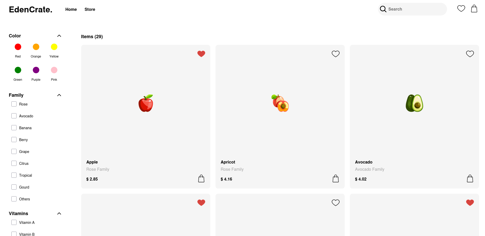
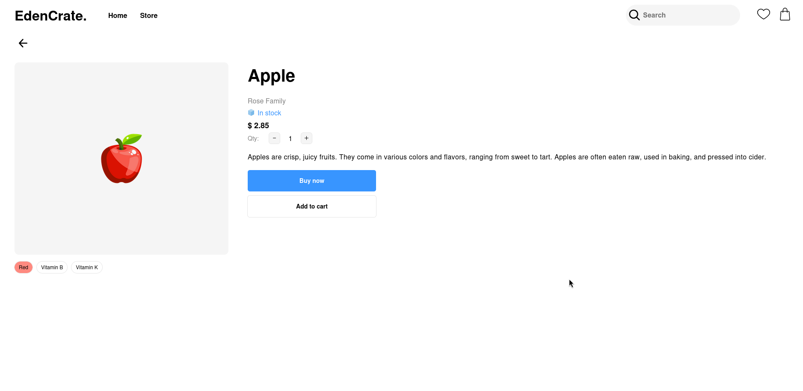
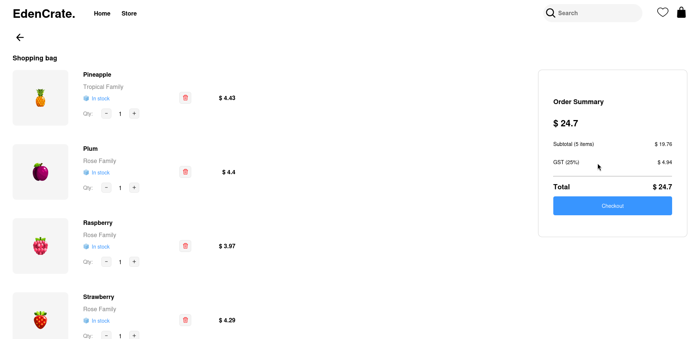

# EdenCrate — Fruit Shopping Cart

A frontend fruit store built with React. Browse a catalog of 30 fruits, filter by name, family, color, or vitamin content, manage favourites, and check out with a live order summary.

---

## Screenshots







---

## Features

- Animated fruit carousel on the landing page
- Product catalog with 30 fruits across multiple families
- Filter sidebar — search by name, fruit family, color, and vitamin
- Favourite toggle with a dedicated favourites-only view
- Individual product pages with description and add-to-cart
- Cart sidebar with quantity controls and item removal
- Checkout page with subtotal, 25% GST calculation, and order total
- Fully client-side — no backend required
- Deployed to GitHub Pages via `gh-pages`

---

## Tech Stack

| Category | Technology |
|---|---|
| Framework | React 19 |
| Routing | React Router v7 |
| State Management | useImmer (Immer-backed useState) |
| Build Tool | Vite |
| Styling | CSS Modules |
| Testing | Vitest + Testing Library |
| Formatting | Prettier |
| Deployment | GitHub Pages (`gh-pages`) |

---

## Project Structure

```
src/
├── App.jsx               # Root component, global state and context
├── Routes.jsx            # Route definitions
├── Fruits.jsx            # Static fruit data (30 items)
├── Filter.jsx            # useFilter custom hook
├── main.jsx
├── index.css
├── component/
│   ├── HomePage.jsx      # Landing page with carousel
│   ├── StorePage.jsx     # Product grid or individual item view
│   ├── ItemPage.jsx      # Single product detail page
│   ├── ProductShowcase.jsx
│   ├── SideBar.jsx       # Filter sidebar
│   ├── Navbar.jsx        # Nav with cart and favourites toggles
│   ├── CheckoutPage.jsx  # Bag, quantity controls, order summary
│   └── ErrorPage.jsx
├── style/                # CSS Modules per component
├── assets/
│   ├── images/fruits/    # 30 fruit PNG icons
│   └── font/             # Self-hosted Helvetica
└── tests/
    ├── Navbar.test.jsx
    ├── ErrorPage.test.jsx
    └── setup.js
```

---

## Pages and Routes

| Path | Page | Description |
|---|---|---|
| `/Shopping-Cart` | Home | Welcome screen with animated carousel |
| `/Shopping-Cart/Store` | Store | Full product grid with filter sidebar |
| `/Shopping-Cart/Store/:name` | Item | Individual product detail and add-to-cart |
| `/Shopping-Cart/Checkout` | Checkout | Cart review, quantity controls, order summary |
| `*` | Error | 404 fallback |

---

## Getting Started

### Prerequisites

- Node.js

### Installation

1. Clone the repository:

   ```bash
   git clone https://github.com/shivanerana/Shopping-Cart.git
   cd Shopping-Cart
   ```

2. Install dependencies:

   ```bash
   npm install
   ```

3. Start the dev server:

   ```bash
   npm run dev
   ```

   The app runs on `http://localhost:5173`.

### Other Commands

```bash
npm run build       # Production build
npm run preview     # Preview the production build locally
npm run test        # Run tests with Vitest
npm run lint        # Run ESLint
npm run pwrite      # Format all files with Prettier
npm run deploy      # Build and deploy to GitHub Pages
```

---

## How It Works

**Filtering** is handled by the `useFilter` custom hook. Filter state (name, family, color, vitamin, favourite) is stored in the root `App` component and distributed via React Context. The `filterFruit` function runs on every render against the full fruit list, so the store grid always reflects the current filter state.

**Cart and favourites** are stored as fields directly on each fruit object in the `fruitList` Immer draft. This means no separate cart array — a fruit is in the cart if `item.inCart === true`. Quantities and `orderPrice` are also tracked per item.

**Checkout** filters `fruitList` for `inCart === true` items and computes subtotal, GST, and total on the fly. Confirming the order clears all cart state and resets quantities to 1.